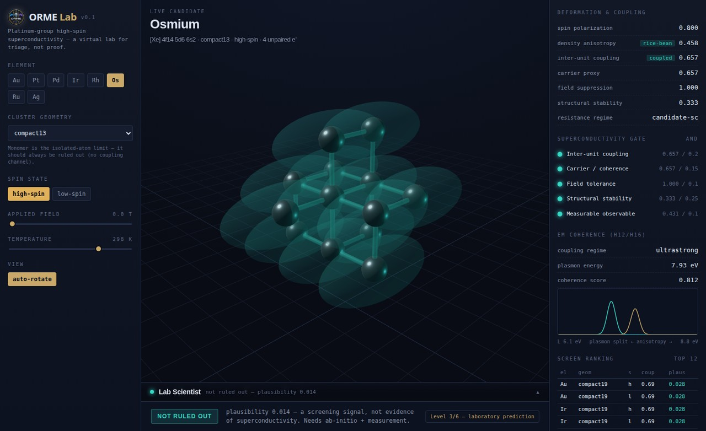

<p align="center">
  
</p>

# orme-lab

A modular **virtual lab** for investigating a specific fringe claim with real
physics: that platinum-group metals (Au, Pt, Pd, Ir, Rh, Os), when driven into an
"Orbitally Rearranged Monatomic Element" (ORME) high-spin state, exhibit
ambient-temperature superconductivity-like behavior.

### 🔬 Interactive 3D lab

An in-browser 3D instrument to pick a candidate (element × geometry × spin state),
apply a magnetic field and temperature, and watch the whole scoring pipeline — the
cluster, the "rice-bean" electron-density ellipsoids, coupling filaments, the
superconductivity gate cascade, and the live plasmon spectrum — recompute in real
time. Runs entirely client-side (a faithful JS port of the Python toy models).

**▶ Live:** https://dezirae-stark.github.io/orme-lab/ &nbsp;·&nbsp; source in [`web/`](web/)

<p align="center">
  
</p>
<p align="center"><sub>The lab screening an osmium compact-13 high-spin candidate: 3D cluster + rice-bean density shells (centre), live scores and the five-gate superconductivity cascade (right), and the verdict bar with its evidence-level stamp and categorical candidate band (bottom).</sub></p>

**What you can do in it:**

- **Screen live.** Pick element × geometry × spin state from the chips; drag the field and temperature sliders; the cluster, density shells, coupling filaments, five-gate cascade, plasmon spectrum, and the ranked candidate table all recompute in real time.
- **Eigenstate mode.** Toggle the heuristic "rice-bean" ellipsoids for the *real* isotropic 3D harmonic-oscillator eigenstates |k, l, m⟩ — E = (2k + l + 3⁄2)ℏω — rendered as translucent light/deep-teal ±phase lobes (marching-tetrahedra isosurfaces). The |ψ|² fractional anisotropy of the rendered state **feeds the density-anisotropy metric**: the picture drives the score, not a hand-tuned number.
- **DFT-cube bridge** *(the endgame path)*. Load a Gaussian `.cube` (a real DFT density ρ or orbital ψ, exported offline) and it is isosurfaced through the *same* marching-tetrahedra + anisotropy pipeline as the analytic eigenstate — a computed density is a drop-in for the model. [`tools/eigenstate_to_cube.py`](tools/eigenstate_to_cube.py) emits a model cube so the path is exercised end-to-end today. A loaded cube upgrades the *descriptor*, not the evidence level — it is still Level 2.
- **Metric drill-downs.** Tap any score or gate for its definition, exact calculation, real-world experimental analogue, a confidence note, and the future measurement that would validate it.
- **Hypothesis registry.** A scientific-notebook tab of the falsifiable hypotheses (H-01…H-20), cross-linked both ways with the live metrics — jump from a hypothesis card to the metric it drives, and from a metric back to its hypotheses.
- **Candidate band.** A categorical **LOW / MEDIUM / HIGH / VERY HIGH** read derived from the *gate-margin cascade* (not the raw score), capped by the weakest necessary gate — a plain-language triage tier layered over the deliberately un-probability-like screening score.
- **Ledger tab.** The falsify-first Hudson Claim Ledger (HC-01…HC-08) as a live dashboard — a claim × material matrix, per-material and integrated (max-lineage, min-claim-over-core) roll-up cards, and evidence-control panels you can drive by hand. Every gate reads default-blocked until you supply real evidence; the strongest attainable state is "Independently Replicated" and the string "HUDSON CLAIM VALIDATED" is never rendered. Same status ladder and thresholds as [`hudson_ledger.py`](src/orme_lab/hudson_ledger.py), parity-tested against it.

The lab includes a **Lab Scientist**: an always-on deterministic analyst that reads
the real gate values for the current candidate and gives grounded readings, ranked
next-experiment suggestions, and caveats (no key, no cost). For *live Claude*
analysis gated to you, run the loopback proxy in [`tools/`](tools/) — it uses your
own credentials on your own machine (`127.0.0.1`), so no outside party on the
public page can reach it. See [`tools/README.md`](tools/README.md). An in-repo
[`orme-lab-scientist`](.claude/agents/orme-lab-scientist.md) Claude Code subagent
covers the same role in a coding session (runs under your Claude plan).

The lab translates that claim into **explicit, falsifiable, computable models**,
runs a screen over candidate `(element × geometry × spin-state)` configurations,
and predicts the experimental signatures that would confirm or kill each lead.

---

## Charter

> ORME Lab is an open computational research laboratory dedicated to translating
> extraordinary claims into testable scientific hypotheses. We do not begin by
> assuming claims are true or false. We construct models, derive predictions,
> perform simulations, design reproducible experiments, and follow the evidence
> wherever it leads.

Hypotheses are welcome; evidence is required; negative results are valuable;
unexpected results are investigated rigorously; reproducibility is the standard
for confidence. Every claim carries an explicit **evidence level (0–6)**, and the
unit of confidence is an *independent, instrumented, reproducible observation*.
See [`docs/CHARTER.md`](docs/CHARTER.md). Everything this repository produces sits
at **Level 2–3** (computational simulation / laboratory prediction) at most.

## Purpose

Give the ORME/PGM high-spin superconductivity claim the one thing it has always
lacked: a **testable model**. Concretely, the lab:

1. encodes each claim as a hypothesis with an explicit rejection condition
   (`docs/hypothesis_matrix.md`),
2. scores candidates through a physics pipeline
   (spin → density anisotropy → inter-unit coupling → field response →
   observables → superconductivity plausibility),
3. ranks candidates and writes a CSV, flagging which are **ruled out** and why,
4. routes surviving candidates to the specific experiment that would be decisive
   (`docs/validation_tests.md`).

## Cautionary scientific framing (read this)

- **This project does not prove superconductivity, and cannot.** Every number it
  emits is a **triage signal** — "worth real computation/measurement" or "ruled
  out under known physics" — never a proof.
- The superconductivity **screening score** is an **AND-gate of necessary
  conditions** (coupling, carriers, field tolerance, structural stability, a
  measurable observable). Fail any one and the score is zero. It can only ever
  report `NOT RULED OUT`, never `PROVEN`. The score is a **triage/ranking value
  in [0, 1] — deliberately *not* a probability**: it says where to look next, not
  how likely superconductivity is. (Internally the code still calls this
  `sc_plausibility`; the user-facing term is "screening score".)
- **Zero resistance is not superconductivity.** Bulk diamagnetic screening (the
  Meissner effect) is a separate, first-class requirement — see
  `docs/validation_tests.md`.
- The current toy models run on the **Python standard library alone**. They are
  deliberately simple stand-ins for ab-initio calculations. Every heavy-physics
  gap is marked `TODO(<backend>)` in the source.
- We take the premise as a **working assumption to reverse-engineer** how it
  *could* be realized — but the validation layer retains real discriminating
  power. A "validation" that cannot fail validates nothing.

## Install

No third-party package is required to run the core screen or the tests.

```bash
git clone <this-repo-url>
cd orme-lab

# core runs on the standard library alone. optional extras:
pip install -e ".[dev]"        # pytest for the test suite
pip install -e ".[plot]"       # numpy + matplotlib for plot_candidate_density.py
pip install -e ".[notebook]"   # jupyter for the notebooks
```

## Quickstart

```bash
# run the full six-element PGM screen and write a ranked CSV
python examples/run_platinum_cluster_screen.py

# gold-focused geometry sweep
python examples/run_gold_cluster_screen.py

# visualize a candidate's 'rice-bean' density (ASCII if matplotlib absent)
python examples/plot_candidate_density.py Os high_spin

# run the tests
pytest
```

Or from Python:

```python
from orme_lab import run_screen, write_csv

records = run_screen()                       # ranked, deterministic
write_csv(records, "outputs/screen.csv")
for r in records[:5]:
    print(r.element, r.geometry, r.spin_label, r.sc_plausibility, r.ruled_out)
```

## The simulation pipeline

```
Element ─▶ Geometry ─▶ SpinState ─▶ Density anisotropy ─▶ Coupling
   │                                                          │
   └──────────────────────────────────────────────┐         ▼
                                                    │   carrier proxy
                                                    ▼         │
                                            Field response ◀──┘
                                                    │
                                                    ▼
                                             Observables
                                                    │
                                                    ▼
                                    Superconductivity plausibility (AND-gate)
                                                    │
                                                    ▼
                                          Ranked CandidateRecord ─▶ CSV
```

Each module owns one hypothesis and exposes one bounded `[0, 1]` score:

| Module | Role | Toy score |
|--------|------|-----------|
| `elements.py` | PGM atomic data | — |
| `geometry.py` | cluster motifs, nearest-neighbour distance | — |
| `spin_states.py` | high/low-spin configs | `spin_polarization_score` |
| `electron_density.py` | 'rice-bean' anisotropy | `electron_density_anisotropy_score` |
| `coupling.py` | inter-unit coupling (the crux) | `inter_unit_coupling_score` |
| `magnetic_field.py` | field stabilize/suppress | `magnetic_field_suppression_factor` |
| `observables.py` | susceptibility, resistance, Meissner | `meissner_screening_proxy` |
| `superconductivity.py` | necessary-condition gate | `superconductivity_plausibility_score` |
| `electromagnetic_coherence.py` | polariton/plasmon coherence (H12/H16) | `polariton_coherence_score` |
| `pipeline.py` | orchestration, ranking, CSV | — |

Beyond the per-hypothesis modules, the package carries the **evidence and gate
infrastructure**: `evidence.py` (the 0–6 hierarchy, the Level-2 lab ceiling and
the Level-3 prediction ceiling), `backends.py` (the optional ab-initio
`DFTBackend` seams), `config.py` (the deterministic `LabConfig`), and the
**falsifiability spine** — `identity.py`, `structure.py`, `mechanisms.py`,
`uncertainty.py`, `validator.py`, `hudson_optical.py`, `branch_verdict.py`,
`lineage.py`, `hudson_ledger.py` — described in the next section.

Full detail: `docs/simulation_pipeline.md`. The determinism guarantee (same
config → byte-identical CSV) is documented there too.

## The falsifiability spine — identity, mechanism, and the Hudson Claim Ledger

Layered over the triage screen is a second architecture whose entire job is to
**stop a promising number from being mistaken for evidence**. Every gate here
*default-blocks*: it stays closed until real, instrumented, reproducible data is
supplied, and the simulation can never open it on its own.

- **Phase-identity gate (`identity.py`).** No candidate is credited as a
  superconductivity lead until an injected characterization witness (composition /
  phase / morphology / oxidation) shows it actually *is* the target material. An
  oxide, salt, or wrong element is a **contradiction** — ruled out, not merely
  uncredited. Default: unestablished.
- **Uncertainty & rank stability (`uncertainty.py`).** Scores carry seeded
  Monte-Carlo intervals plus an analytic cross-check and a rank-stability measure,
  so a ranking never implies more precision than the thresholds support (a sharp
  early result: no candidate holds rank 1 across all draws).
- **Structural distribution (`structure.py`).** A real preparation is a
  *distribution* over populations (isolated atoms, dimers, sub-nm clusters), not a
  single geometry; the screen evaluates the mixture (`f1`, P(n), R_PGM–PGM) and
  reports the credited *fraction*.
- **Mechanism-specific pairing tracks (`mechanisms.py`).** Five independent
  channels (phonon, spin-fluctuation, triplet, excitonic/polaritonic,
  granular-Josephson), each with its own necessary conditions. A static local
  moment **pair-breaks** singlet phonon pairing (Abrikosov–Gor'kov) but *enables*
  the magnetic channels — so a high-spin candidate is credited only via a magnetic
  mechanism, never phonon. Partial strengths are never blended into one score.
- **Adversarial validator (`validator.py`).** For a candidate it designs the
  decisive experiments that separate a genuine coherent phase from the mundane
  alternatives (metallic filament, ionic conduction, artifact), routed *per
  surviving mechanism* — isotope effect for phonon, Shapiro steps for granular,
  NMR Knight shift for triplet, and so on.

### Two independent branches

Hudson did not describe an ordinary zero-resistance metal; he described a
resonantly-accessible, macroscopically coherent hybrid light–matter state. The lab
therefore tests **two independent branches, never merged**:

- **Branch A — conventional superconductivity:** the AND-gate + mechanism tracks above.
- **Branch B — Hudson optical coherence (`hudson_optical.py`):** an order parameter
  *O_H = {ω₀, Q, g, τ_coh, L_coh, f_ph, f_el}* with polariton mode composition and
  anticrossing, a broadband RF→near-UV resonance survey, and an eight-level claim
  ladder. Its two extraordinary claims — a **self-sustaining** (persistent, not
  merely metastable) post-drive ring-down, and a magnetic response **causally
  tracking** the optical resonance (∂M/∂P) — are default-blocked behind measured
  input. `branch_verdict.py` reports the two branches side by side; the full
  "Hudson optical superconductive phase" is a top-level *prediction*, never a
  crediting verdict or a blended score.

### The Hudson Claim Ledger

`hudson_ledger.py` assesses Hudson's eight ORME claims (HC-01…HC-08) falsify-first
— each with its strongest mundane alternative attacked first — and composes the
compound gate

```
G_Hudson = G_identity ∧ G_transport ∧ G_magnetism ∧ G_replication
```

Its objective is **not to validate Hudson** but to *determine whether a
reproducible material state exists that satisfies Hudson's stated properties*. Two
commitments keep that honest:

- **Two roll-ups, kept separate.** A claim-level *best-of* ("has any material
  supported this individual claim?") and an integrated `max_lineage(min_claim)`
  ("does *one materially continuous lineage* satisfy the combined state?"). The
  forbidden `min_claim(max_candidate)` — which would let a nonmetallic specimen, a
  superconducting specimen, and an optically-coherent specimen be **stitched into a
  fake success** — is never computed. Material provenance (`lineage.py`) tracks
  same-specimen / same-batch / same-lineage, so a claim observed after annealing or
  field treatment attaches to the *resulting* state, not the precursor.
- **Default-blocked and never "validated".** Transport, magnetism, and replication
  gates are false without measured evidence; the ledger never self-asserts the
  Hudson mechanism from simulation and never emits "HUDSON CLAIM VALIDATED." The
  strongest terminal verdict is `independent-replication-achieved`, reachable only
  with real cross-lab replication metadata. `credited_sc_lead` maps to a *lead*,
  never *supported*.

That is the lab's contribution: the place where each of Hudson's claims is
separated into exact experiments, the ordinary explanation attacked first, and only
surviving effects advanced. Design:
[`docs/superpowers/specs/2026-07-11-hudson-claim-ledger-design.md`](docs/superpowers/specs/2026-07-11-hudson-claim-ledger-design.md);
reference: [`docs/hudson_claim_ledger.md`](docs/hudson_claim_ledger.md).

## The EPW backend — a real electron-phonon Tc (the endgame seam)

The one path in the architecture that computes a *real* superconducting Tc
rather than a triage score. `src/orme_lab/epw/` implements the
`Capability.SC_GAP` seam: it builds a periodic approximant of a candidate, drives
Quantum ESPRESSO + EPW (`pw.x → ph.x → nscf → epw.x`), parses the Eliashberg
spectral function α²F(ω), and evaluates the McMillan–Allen–Dynes Tc:

```
α²F(ω) ─▶ λ, ω_log, ω̄₂ ─▶ Tc = f₁f₂ (ω_log/1.20) · exp[ −1.04(1+λ) / (λ − μ*(1 + 0.62λ)) ]
```

Wire it in like any backend; the computed Tc is reported **alongside** the
unchanged five-gate triage, in new `sc_tc_kelvin` / `sc_lambda` /
`sc_omega_log_k` / `sc_gap_mev` / `sc_source` columns:

```python
from orme_lab import run_screen
from orme_lab.backends import EPWBackend

records = run_screen(backend=EPWBackend())   # needs pw.x/ph.x/epw.x on PATH + pseudopotentials
```

Modules: `spectral.py` (α²F moments), `allen_dynes.py` (Tc + BCS gap),
`approximant.py` (the periodic reference lattice), `config.py` (`EPWConfig`),
`parse.py` (the 11-column `.a2f` reader), `runner.py` (subprocess orchestration),
`qe_input.py` (deck writers), `result.py` (`EPWResult`). The deterministic core is
fully unit-tested against analytic and reference-code oracles (e.g. the golden
`Tc = 21.95 K` at λ=1, ω_log=300 K, μ\*=0.10; the sub-critical guard forcing
`Tc = 0` below λ_crit); only the live subprocess path needs the binaries.

> **Read this before trusting a number.** This Tc is a **phonon-channel,
> spin-singlet counterfactual on an *imposed* periodic reference lattice**
> inferred from a cluster's nearest-neighbour distance — *not* the finite
> cluster, *not* the ORME high-spin motif, *not* any observed phase. For a
> high-spin *magnetic* system the physically relevant pairing channel is
> spin-fluctuation / triplet (a different kernel EPW does not compute), Migdal's
> theorem is likely violated, and Allen–Dynes carries no magnetic pair-breaking
> term — so **a returned Tc is not evidence the material superconducts.** At most
> it supports phonon-mechanism *ruling-out*. Evidence stays capped at **Level
> 2**; a wired backend does not raise it. The Allen–Dynes constants are verified
> against Allen & Dynes 1975 via secondary sources (the primary PRB is
> paywalled); the live decks and `.a2f` parsing have not yet been run against a
> real EPW install and must be re-verified there. Design:
> [`docs/superpowers/specs/2026-07-03-epw-backend-design.md`](docs/superpowers/specs/2026-07-03-epw-backend-design.md).

## Repository layout

```
docs/          hypothesis matrix, pipeline, validation tests, terminology, CHARTER,
               patent-claim tests, the Hudson Claim Ledger reference,
               superpowers/ (design specs + implementation plans for each feature)
src/orme_lab/  the package: pipeline + the falsifiability spine (identity, structure,
               mechanisms, uncertainty, validator, hudson_optical, branch_verdict,
               lineage, hudson_ledger) + patent-triage screens (ir_signature,
               ir_contaminant, thermal_stability, meissner_field, control_experiment)
src/orme_lab/epw/  the EPW electron-phonon Tc backend (SC_GAP seam; see above)
web/           the interactive 3D lab + research platform (static; GitHub Pages)
tools/         eigenstate_to_cube.py, the loopback Claude proxy, tools/README
tests/         pytest suite — 375 tests (toy models, EPW backend, the whole spine)
examples/      runnable screens + density plot
notebooks/     00 project overview, 01 hypothesis mapping
outputs/       generated CSVs / figures (git-ignored except .gitkeep)
.github/       Pages deploy workflow (build → publish web/ on push to master)
```

The site auto-deploys: pushing a change under `web/` to `master` triggers
[`.github/workflows/deploy-pages.yml`](.github/workflows/deploy-pages.yml), which
publishes `web/` to GitHub Pages via the first-party Pages actions (retryable from
the Actions tab, concurrency-guarded). No manual publish step.

## Future roadmap

The current models are triage stand-ins. Each `TODO(<backend>)` seam is now a
concrete extension point in [`src/orme_lab/backends.py`](src/orme_lab/backends.py)
— a `DFTBackend` interface + named adapter stubs (ASE, PySCF, GPAW, ORCA, NWChem,
Quantum ESPRESSO, EPW) keyed to a `Capability` enum. Subclass one, override a
seam, decorate with `@implemented(Capability.X)`, and pass it to
`run_screen(backend=...)`; the pipeline uses it only where it's genuinely
implemented and falls back to the toy model everywhere else. Intended integration
order (each gap is marked `TODO(<backend>)` in the source):

1. **ASE** — structure handling and geometry relaxation.
2. **PySCF / GPAW** — cluster/periodic DFT for real spin densities and
   charge-density anisotropy (replaces the ellipsoid heuristic). These emit
   Gaussian `.cube` densities that drop straight into the interactive renderer
   through the **DFT-cube bridge** (`DFTBackend.density_cube` → `web/cube.js`),
   so a real calculation is visualized and scored by the same pipeline as the
   analytic eigenstate.
3. **Tight-binding fit** — real transfer integrals `t_ij` for coupling.
4. **Quantum ESPRESSO + EPW** ✅ *(seam implemented)* — electron-phonon coupling
   and a McMillan–Allen–Dynes Eliashberg Tc, the only defensible route to a real
   superconductivity estimate. Wired behind `Capability.SC_GAP` in
   [`src/orme_lab/epw/`](src/orme_lab/epw/) — see "The EPW backend" above. The
   deterministic core is tested; the live `pw.x/ph.x/epw.x` path needs the
   binaries and the result stays a Level-2 phonon-channel counterfactual, not a
   superconductivity claim.
5. **ORCA / NWChem** — molecular reference calculations, spin-orbit coupling
   (important for 5d metals).
6. **`electromagnetic_coherence.py`** ✅ *(implemented)* — models H12/H16:
   polaritonic / plasmonic coherence, the charitable translation of Hudson's
   "light flows through it." Kept deliberately separate from the SC gate: a
   coherent quantum material is not a superconductor. `TODO(dft/rpa)`: replace the
   free-electron plasmon estimate with a computed dielectric function ε(q, ω).
   See `docs/terminology_translation.md`.

## Documentation index

- `docs/CHARTER.md` — mission, principles, the evidence hierarchy (0–6), and the instrumented-reproducibility standard
- `docs/hypothesis_matrix.md` — every claim as a falsifiable hypothesis + rejection condition
- `docs/simulation_pipeline.md` — data flow, score meanings, determinism, backends
- `docs/validation_tests.md` — the falsification playbook (why zero-R ≠ SC, the corrected gap relation, G_identity)
- `docs/terminology_translation.md` — the Physics Translation Matrix (ORME → modern physics)
- `docs/hudson_claim_ledger.md` — the HC-01…HC-08 ledger: gates, the two roll-ups, default-blocks, and the never-"validated" invariant
- `docs/patent-claim-tests.md` — the patent-signature triage screens (IR doublet, thermal stability, Meissner) that feed HC-04/HC-06

## License

MIT (see `pyproject.toml`).
