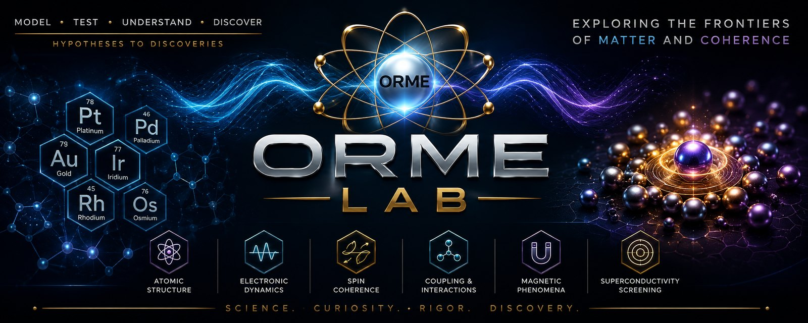

<p align="center">
  
</p>

# orme-lab

A modular **virtual lab** for investigating a specific fringe claim with real
physics: that platinum-group metals (Au, Pt, Pd, Ir, Rh, Os), when driven into an
"Orbitally Rearranged Monatomic Element" (ORME) high-spin state, exhibit
ambient-temperature superconductivity-like behavior.

### 🔬 Interactive 3D lab

An in-browser 3D instrument to pick a candidate (element × geometry × spin state),
apply a magnetic field and temperature, and watch the whole scoring pipeline — the
cluster, the "rice-bean" electron-density ellipsoids, coupling filaments, the
superconductivity gate cascade, and the live plasmon spectrum — recompute in real
time. Runs entirely client-side (a faithful JS port of the Python toy models).

**▶ Live:** https://dezirae-stark.github.io/orme-lab/ &nbsp;·&nbsp; source in [`web/`](web/)

The lab includes a **Lab Scientist**: an always-on deterministic analyst that reads
the real gate values for the current candidate and gives grounded readings, ranked
next-experiment suggestions, and caveats (no key, no cost). For *live Claude*
analysis gated to you, run the loopback proxy in [`tools/`](tools/) — it uses your
own credentials on your own machine (`127.0.0.1`), so no outside party on the
public page can reach it. See [`tools/README.md`](tools/README.md). An in-repo
[`orme-lab-scientist`](.claude/agents/orme-lab-scientist.md) Claude Code subagent
covers the same role in a coding session (runs under your Claude plan).

The lab translates that claim into **explicit, falsifiable, computable models**,
runs a screen over candidate `(element × geometry × spin-state)` configurations,
and predicts the experimental signatures that would confirm or kill each lead.

---

## Charter

> ORME Lab is an open computational research laboratory dedicated to translating
> extraordinary claims into testable scientific hypotheses. We do not begin by
> assuming claims are true or false. We construct models, derive predictions,
> perform simulations, design reproducible experiments, and follow the evidence
> wherever it leads.

Hypotheses are welcome; evidence is required; negative results are valuable;
unexpected results are investigated rigorously; reproducibility is the standard
for confidence. Every claim carries an explicit **evidence level (0–6)**, and the
unit of confidence is an *independent, instrumented, reproducible observation*.
See [`docs/CHARTER.md`](docs/CHARTER.md). Everything this repository produces sits
at **Level 2–3** (computational simulation / laboratory prediction) at most.

## Purpose

Give the ORME/PGM high-spin superconductivity claim the one thing it has always
lacked: a **testable model**. Concretely, the lab:

1. encodes each claim as a hypothesis with an explicit rejection condition
   (`docs/hypothesis_matrix.md`),
2. scores candidates through a physics pipeline
   (spin → density anisotropy → inter-unit coupling → field response →
   observables → superconductivity plausibility),
3. ranks candidates and writes a CSV, flagging which are **ruled out** and why,
4. routes surviving candidates to the specific experiment that would be decisive
   (`docs/validation_tests.md`).

## Cautionary scientific framing (read this)

- **This project does not prove superconductivity, and cannot.** Every number it
  emits is a **triage signal** — "worth real computation/measurement" or "ruled
  out under known physics" — never a proof.
- The superconductivity plausibility score is an **AND-gate of necessary
  conditions** (coupling, carriers, field tolerance, structural stability, a
  measurable observable). Fail any one and the score is zero. It can only ever
  report `NOT RULED OUT`, never `PROVEN`.
- **Zero resistance is not superconductivity.** Bulk diamagnetic screening (the
  Meissner effect) is a separate, first-class requirement — see
  `docs/validation_tests.md`.
- The current toy models run on the **Python standard library alone**. They are
  deliberately simple stand-ins for ab-initio calculations. Every heavy-physics
  gap is marked `TODO(<backend>)` in the source.
- We take the premise as a **working assumption to reverse-engineer** how it
  *could* be realized — but the validation layer retains real discriminating
  power. A "validation" that cannot fail validates nothing.

## Install

No third-party package is required to run the core screen or the tests.

```bash
git clone <this-repo-url>
cd orme-lab

# core runs on the standard library alone. optional extras:
pip install -e ".[dev]"        # pytest for the test suite
pip install -e ".[plot]"       # numpy + matplotlib for plot_candidate_density.py
pip install -e ".[notebook]"   # jupyter for the notebooks
```

## Quickstart

```bash
# run the full six-element PGM screen and write a ranked CSV
python examples/run_platinum_cluster_screen.py

# gold-focused geometry sweep
python examples/run_gold_cluster_screen.py

# visualize a candidate's 'rice-bean' density (ASCII if matplotlib absent)
python examples/plot_candidate_density.py Os high_spin

# run the tests
pytest
```

Or from Python:

```python
from orme_lab import run_screen, write_csv

records = run_screen()                       # ranked, deterministic
write_csv(records, "outputs/screen.csv")
for r in records[:5]:
    print(r.element, r.geometry, r.spin_label, r.sc_plausibility, r.ruled_out)
```

## The simulation pipeline

```
Element ─▶ Geometry ─▶ SpinState ─▶ Density anisotropy ─▶ Coupling
   │                                                          │
   └──────────────────────────────────────────────┐         ▼
                                                    │   carrier proxy
                                                    ▼         │
                                            Field response ◀──┘
                                                    │
                                                    ▼
                                             Observables
                                                    │
                                                    ▼
                                    Superconductivity plausibility (AND-gate)
                                                    │
                                                    ▼
                                          Ranked CandidateRecord ─▶ CSV
```

Each module owns one hypothesis and exposes one bounded `[0, 1]` score:

| Module | Role | Toy score |
|--------|------|-----------|
| `elements.py` | PGM atomic data | — |
| `geometry.py` | cluster motifs, nearest-neighbour distance | — |
| `spin_states.py` | high/low-spin configs | `spin_polarization_score` |
| `electron_density.py` | 'rice-bean' anisotropy | `electron_density_anisotropy_score` |
| `coupling.py` | inter-unit coupling (the crux) | `inter_unit_coupling_score` |
| `magnetic_field.py` | field stabilize/suppress | `magnetic_field_suppression_factor` |
| `observables.py` | susceptibility, resistance, Meissner | `meissner_screening_proxy` |
| `superconductivity.py` | necessary-condition gate | `superconductivity_plausibility_score` |
| `electromagnetic_coherence.py` | polariton/plasmon coherence (H12/H16) | `polariton_coherence_score` |
| `pipeline.py` | orchestration, ranking, CSV | — |

Full detail: `docs/simulation_pipeline.md`. The determinism guarantee (same
config → byte-identical CSV) is documented there too.

## Repository layout

```
docs/         hypothesis matrix, pipeline, validation tests, terminology translation
src/orme_lab/ the package (one module per hypothesis)
tests/        pytest suite (element, spin, coupling, observables/pipeline)
examples/     runnable screens + density plot
notebooks/    00 project overview, 01 hypothesis mapping
outputs/      generated CSVs / figures (git-ignored except .gitkeep)
```

## Future roadmap

The current models are triage stand-ins. The intended integration order (each
gap is marked `TODO(<backend>)` in the source):

1. **ASE** — structure handling and geometry relaxation.
2. **PySCF / GPAW** — cluster/periodic DFT for real spin densities and
   charge-density anisotropy (replaces the ellipsoid heuristic).
3. **Tight-binding fit** — real transfer integrals `t_ij` for coupling.
4. **Quantum ESPRESSO + EPW** — electron-phonon coupling and an Eliashberg gap —
   the only defensible route to a real superconductivity estimate.
5. **ORCA / NWChem** — molecular reference calculations, spin-orbit coupling
   (important for 5d metals).
6. **`electromagnetic_coherence.py`** ✅ *(implemented)* — models H12/H16:
   polaritonic / plasmonic coherence, the charitable translation of Hudson's
   "light flows through it." Kept deliberately separate from the SC gate: a
   coherent quantum material is not a superconductor. `TODO(dft/rpa)`: replace the
   free-electron plasmon estimate with a computed dielectric function ε(q, ω).
   See `docs/terminology_translation.md`.

## Documentation index

- `docs/CHARTER.md` — mission, principles, the evidence hierarchy (0–6), and the instrumented-reproducibility standard
- `docs/hypothesis_matrix.md` — every claim as a falsifiable hypothesis + rejection condition
- `docs/simulation_pipeline.md` — data flow, score meanings, determinism, backends
- `docs/validation_tests.md` — the falsification playbook (why zero-R ≠ SC, etc.)
- `docs/terminology_translation.md` — the Physics Translation Matrix (ORME → modern physics)

## License

MIT (see `pyproject.toml`).
